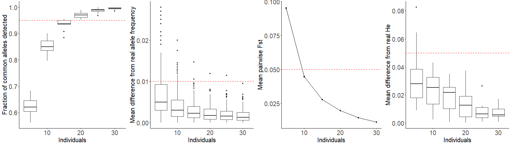
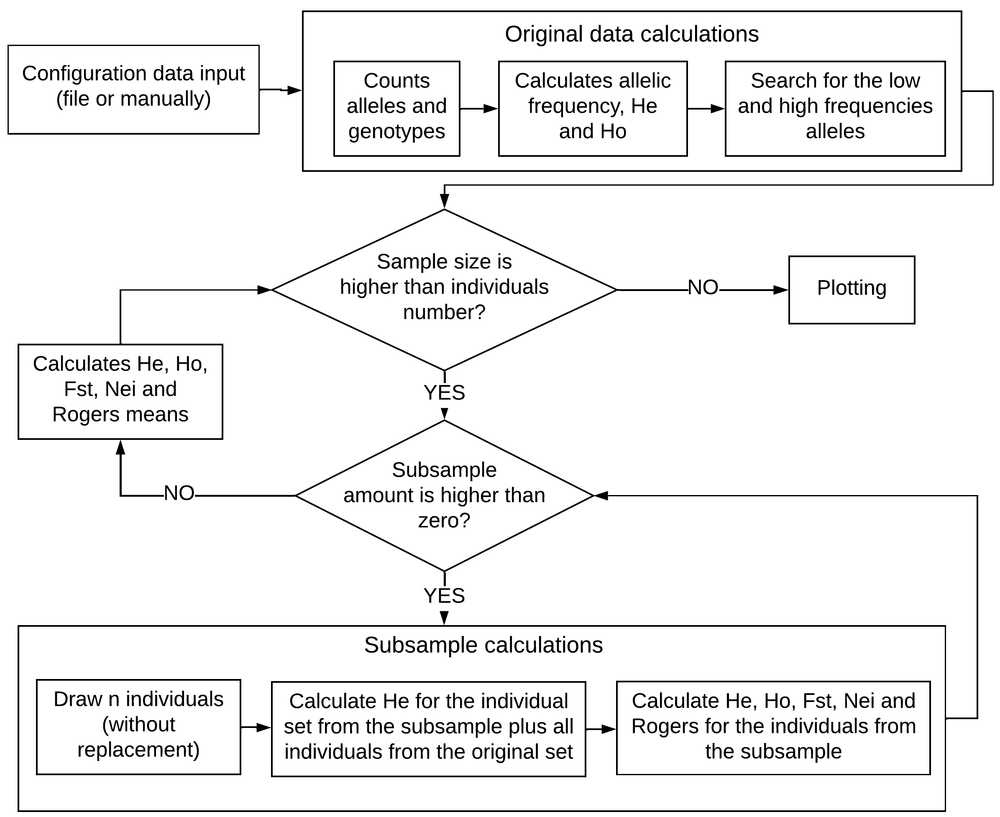

Overview
========

Briefly, the program randomly subsamples the input dataset and estimates genetics 
parameters of each subsample such as mean number of alleles, allele frequencies, 
heterozygosities observed and expected under Hardy-Weinberg Equilibrium and inbreeding. 
It also estimates genetic distances between subsample and the original dataset. 
The output plots show comparisons of results from multiple sample subset sizes. 
The parameters are estimated for each locus, so no linkage disequilibrium assumptions are necessary.

Output
------

The output from SaSii are generated by plotting the estimated values across sample sizes.
Currently, the plots generated are:

* Alleles detected with frequencies above 0.05. (*)
* Mean difference from original allele frequency. (*)
* Frequencies of the most and less common alleles. 
* Impact of expected heterozygosity for each locus. 
* Mean of expected heterozygosity. 
* Mean pairwise Fst. (*)
* Mean pairwise Nei’s genetic distance.
* Mean pairwise Rogers’ genetic distance. 
* Mean of observed heterozygosity.
* Impact of observed heterozygosity for each locus.
* Mean difference from the original observed heterozygosity.
* Mean difference from the original expected heterozygosity. (*)

Plots marked as (*) are suggested plots to estimate the minimum sample size for most species and studies.
The suggested plots uses predefined thresholds: above 9.5 and under 0.01, 0.05 and 0.05.

Example of an output:

In the following image, it is printed the fluxogram that represents the key components from the script code.

