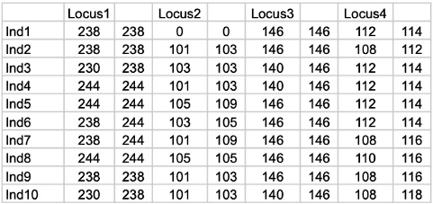
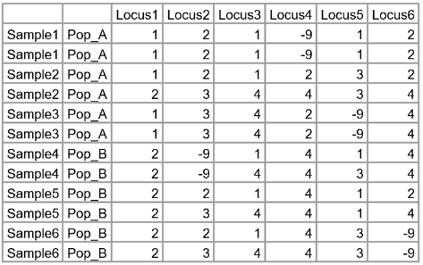

Usage
=====

Availability
------------

The source code is available at `GitHub <https://github.com/Scaketti/sasii>`_

Requirements
------------

**SaSii** is a R script and it uses the following packages:

* readr.
* gridExtra.
* grid.
* tidyr.
* ggplot2.
* plyr.

It can be used in most common systems such as Windows, Linux and macOS.

How to Run
----------

Firstly, every SaSii's run requires the input data about the genetic parameters and running thresholds.
This information must be entered from a config file or manually from terminal. The expected input are:

* **sample_name:** directory and file name
* **str_type:** CSV/Structure file's style ('1' one line alleles; '2' two lines alleles)
* **indef_number:** Character used for missing data
* **begin_line:** Line number with loci names
* **sample_size:** Define size of the smallest subsample to be analysed 
* **resampling:** Define number of resamples for each subsample
* **min_frequence:** Define minimal frequence of allele to be preserved
* **separator:** ASCII value representing the character which separates each allele/locus
* **read_lines:** Number of lines to be read in data file, including line with loci names (important for multipopulation files)
* **begin_column:** Define column number where genotype data starts (see csv header to know)
* **is_gbs:** Determines if the data is GBS or not (1 - true; 0 - false)
* **header_line:** Line number containing columns names (0 - if not present)
* **max_indv_pop:** Max individual for each population

**Input file's format:**

SaSii expect the datafile format from Structure and 
accepts some minor variations of the original format, as described below. 
Both microsatellite and SNP data may be analysed with this package.  
All data must be included in a matrix in a single file, saved as csv. 
We advise the users to follow this data format to avoid script errors.

This example has one extra column (first column) with individual labels, 
and one extra row (first row) with loci labels. Each individual is coded in a 
single row and the two alleles of each locus are coded in two consecutive columns. 
Microsatellite alleles are coded as fragment sizes, and missing data as zeros (“0”).

Example of alternative input datafile with 6 individuals and 6 SNP loci from a diploid species. 
This example has two extra columns with individual labels (first column) and sampling 
locations labels (second column), and one extra row (first row) with loci labels. 
Each individual is coded in two consecutive rows because the two alleles of each 
locus are on two consecutive rows. SNP alleles are coded as integers (e.g. 1 = A, 2 = C, 3 = G, 4 = T) 
and missing data as “-9”.

Data for **individuals are in rows**, and the **loci are in columns**. 
In the default format, each line contains data of one individual and 
alleles from the same genotype are stored in consecutive columns. 
An alternative format with each individual genotype stored in 2 consecutive rows, 
with each locus in one column is accepted, but the user must change the default 
settings in the function (see details in section ___).  

**Loci names** must be short and simple. We suggest to use locus1, locus2, locus3 as loci names. 
Olther names may be used as long as they are short and only contain letters, numbers, dash and underscore. 

**Genotypes** may be coded as fragment size, sequential or random numbers, and as letters.  

**Extra header columns** may be present in the file. The user informs in which column the genotypic data starts. 
Default setting is one header column of individual names. 